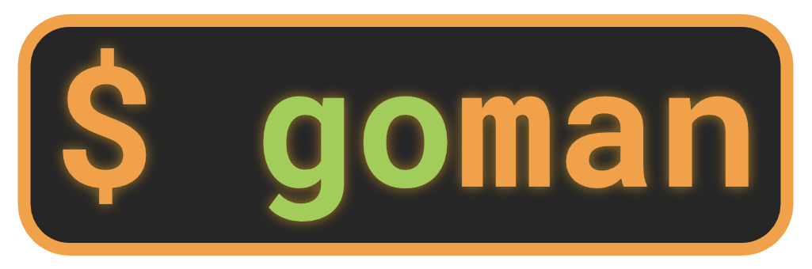
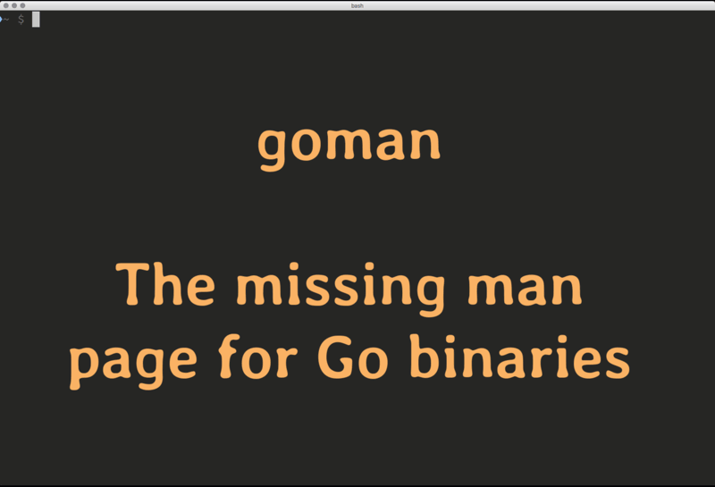

# goman - the missing man page for Go binaries



Almost all Go binaries come without any man page, even when properly installed through means like Homebrew.

`goman` substitutes the missing man page by the README file from the Go binary's sources.

`goman` first grabs the source path from the binary. Then it tries to locate the README file locally via the GOPATH. If this fails, it tries to fetch the README file from the binary's public repository. 

For that last option, `goman` makes a couple of assumptions about the location, but at least with github and gitlab, those assumptions should be valid. 


## Demo




## Usage

    goman <go binary file>

    goman <go binary file> | less -R

(`-R` tells `less` to render ANSI color codes.)


## Installation 

    go get -u github.com/christophberger/goman


## Shell Integration

`goman` can blend in with the standard `man` command. Bash example (to be placed in `~/.bashrc`):

```
man() { 
    if ! /usr/bin/man $1; then 
        goman $1 | less -R; 
    fi; 
}
```

**On macOS,** ensure to source `~/.bashrc` at the end of `~/.bash_profile`, as the Terminal app starts all shells as login shells that do not read `.bashrc`. (Background information on this is available [here](http://scriptingosx.com/2017/04/about-bash_profile-and-bashrc-on-macos/) or [here](https://unix.stackexchange.com/questions/119627/why-are-interactive-shells-on-osx-login-shells-by-default) or via search engines.)  
(Adding this script directly to `~/.bash_profile` is perhaps not a good idea as some interactive shells may start as non-login shells and therefore do not source `~/.bash_profile`.)


## Credits and Licenses

All code written by myself is governed by a 3-clause BSD license, see [LICENSE.txt](https://github.com/christophberger/goman/blob/master/LICENSE.txt).

The `which` package is part of the [which command](https://github.com/bfontaine/which) that is licensed under the MIT license; see [LICENSE.which.txt](https://github.com/christophberger/goman/blob/master/LICENSE.which.txt).

The code that extracts the source code path from a go binary is a part of the [`gorebuild` tool](https://github.com/FiloSottile/gorebuild) that is published under the MIT license; See [LICENSE.dwarf.go.txt](https://github.com/christophberger/goman/blob/master/LICENSE.dwarf.go.txt).

The Markdown renderer is [a fork](https://github.com/ec1oud/blackfriday) of [blackfriday](https://github.com/russross/blackfriday) with extra code for rendering Markdown to plain text with ANSI color codes. See [LICENSE.blackfriday.txt](https://github.com/christophberger/goman/blob/master/LICENSE.blackfriday.txt) and the copyright notice in [ec1oud/blackfriday/ansi.go](https://github.com/christophberger/goman/blob/master/vendor/github.com/ec1oud/blackfriday/ansi.go).


## Bugs And Limitations

Not tested on Windows yet.

In its current state, `goman` is little more than a proof of concept. Bugs certainly do exist, as well as functional shortcomings due to oversimplified design, such as:

* `goman` assumes that the README file contains either Markdown text or plain text. I know of at least one README.md that contains HTML. `goman` does not treat such cases in any special way.

* `goman` assumes that a command subproject is always in `<projectdir>/cmd/`. If the cmd dir has a different name, `goman` 

* If a binary originates from a command subdirectory of a project, chances are that this subdirectory contains no extra README file. `goman` then tries to retrieve the README file of the main project. However, `goman` can only identify a command subdir if it has the name `cmd`, or if it is beneath a directory of that name.

* Some binaries contain an absolute path to their source code, and `goman` assumes that the GOPATH is the part that extends to the first directory named `/src/`. If the GOPATH exists in a path that contains a `/src/` directory, `goman` fails extracting the relative source code path.

* `goman` attempts no word wrapping.

* Canonical URL's are not handled right now.


## See also

[mdcat](https://github.com/ec1oud/mdcat) - a `cat` tool for Markdown

[mandown](https://github.com/driusan/mandown) - write *real* man pages in Markdown

[mango](https://github.com/slyrz/mango) - generate man pages from your source code

[gorebuild](https://github.com/FiloSottile/gorebuild) - rebuild Go binaries from source

[binstale](https://github.com/shurcooL/binstale) - check if your go binaries are outdated

[bin](https://github.com/rjeczalik/bin) and gobin - update all your Go binaries

## Changelog

### v0.1.2 (2017-06-27)

Fix slice panic if URL path is shorter than "github.com"